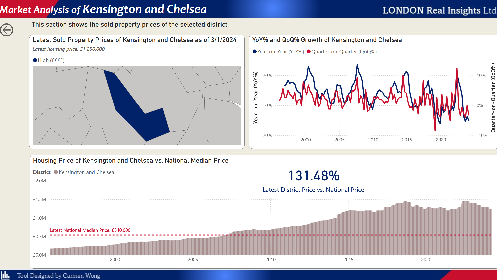

# Intelligence Report on London Real Estate

An interactive [Power BI dashboard](https://app.powerbi.com/view?r=eyJrIjoiZDYyMDY3ZmQtOTk0Zi00Mzk5LWI3YmQtYTQ3NTY1NmM1NTg5IiwidCI6IjZjMWQ0MTUyLTM5ZDAtNDRjYS04OGQ5LWI4ZDZkZGNhMDcwOCIsImMiOjEwfQ%3D%3D) for analyzing the London housing market, allowing users to explore property prices, features, school quality, and district-level trends.

---

## Skills Demonstrated
✔ **Business Intelligence & Visualization**
- Designed multi-page dashboards with clear navigation, drillthrough, and interactive filtering.
- Built geospatial maps, heatmaps, word clouds and trend analysis to support market insights.

✔ **Data Modeling & Semantic Layer**
- Developed a *star schema* with fact and dimension tables.
- Managed relationships, cardinality, and DAX calculations for analytics.

✔ **Analytical Insight & Storytelling**
- Analyzed property listings across different districts from the perspectives of pricing trends, nearby schools ratings and property features.
- Modeled YoY (year-on-year) and QoQ (quarter-on-quarter) pricing trends and compared districts against the national median.

✔ **User Experience & Interaction**
- Enabled drillthrough and hover tooltips.
- Implemented a comprehensive filter pane with numeric sliders, dropdowns, and school-related filters.

---

## Use Case
> **Disclaimer:**  
> *This project uses synthetic data. All statistics, trends, and insights are for demonstration and educational purposes only and do not reflect actual London housing market conditions.*

This is a report designed for London Real Insights Ltd., a hypothetical real estate agency based in London.

It provides management of the Company with a comprehensive view of property listings across various districts in the city. Users can filter listings based on specific criteria, including property price, house features, and schools in the neighborhood. 

---

## Features

- **Dashboard**: Synthesized listings into high-level KPIs, including median asking prices, normalized property dimensions, and aggregated school performance.
- **District Heatmaps**: Visualize asking and sold prices (via drillthrough) across London districts.
- **School Analytics**: Map property listings by proximity to schools, Ofsted ratings, school size, and class size.
- **Listings Explorer**: Browse listings by district, location, and feature word clouds.
- **Market Trends**: Track historical price trends, growth rates, and compare district prices to national medians.

---

## Key Insights

- High-performing school districts (Ofsted "Outstanding") directly correlate with listing density and price stability. For example, Harrow emerged as a top-tier "value" district, boasting the highest volume of listings (506) near Outstanding schools. 
- Highest asking prices concentrated in the centre (e.g. Kensington and Chelsea, Westminster, and City of London) and the most affordable options found on the outskirts.
- Despite short-term volatility, the 20-year trend line confirms London’s status as a resilient "safe haven" for capital, with consistent recovery patterns following the economic shocks in the 2008 financial crisis and the 2020 pandemic.
- Natural Language Processing (NLP) on property descriptions reveals that "Large" "Backyard" and "Family" are the most frequent keywords, signaling a permanent shift in buyer priority toward square footage and outdoor space and family-friendliness.
  
---

## Workflow Overview

1. **Access Power BI report online** [here](https://app.powerbi.com/view?r=eyJrIjoiZDYyMDY3ZmQtOTk0Zi00Mzk5LWI3YmQtYTQ3NTY1NmM1NTg5IiwidCI6IjZjMWQ0MTUyLTM5ZDAtNDRjYS04OGQ5LWI4ZDZkZGNhMDcwOCIsImMiOjEwfQ%3D%3D)
2. **Navigate via the sidebar or the homepage** to explore:
   - **Summary (Dashboard)**: Market snapshot and key figures.
   - **Listings**: Average prices, property locations, and feature word clouds.
   - **Schools**: Listings by school rating, size, and proximity.
   - **Market**: Trends of the property price by districts and comparison to the national median.
3. **Interact with filters and slicers** to customize your analysis:
   - Filter by year, district, home type, or features.
   - Use the outlier exclusion toggle for robust statistics.
   
---

## Screenshots

The report comprises four primary sections as below.

### Dashboard 

### Listings

### Drillthrough on Seleteced District

### Schools Analystics

### Market Analysis

---

## Data Sources

> **Note:**  
> All [datasets](https://raw.githubusercontent.com/cckmwong-data/london_housing/main/dataset/housing_data.xlsx) used in this project are synthetic, created to mimic real-world patterns for educational and analytical demonstration only. No real personal, commercial, or sensitive data is included.

---

## Author

**Carmen Wong**  

---
