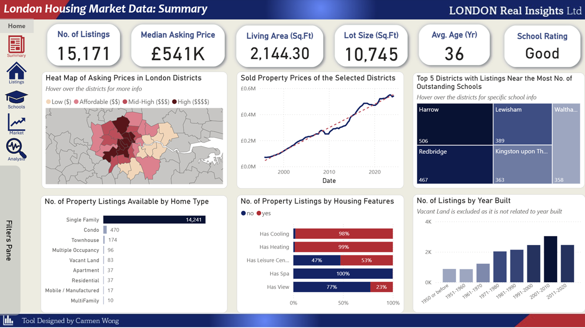
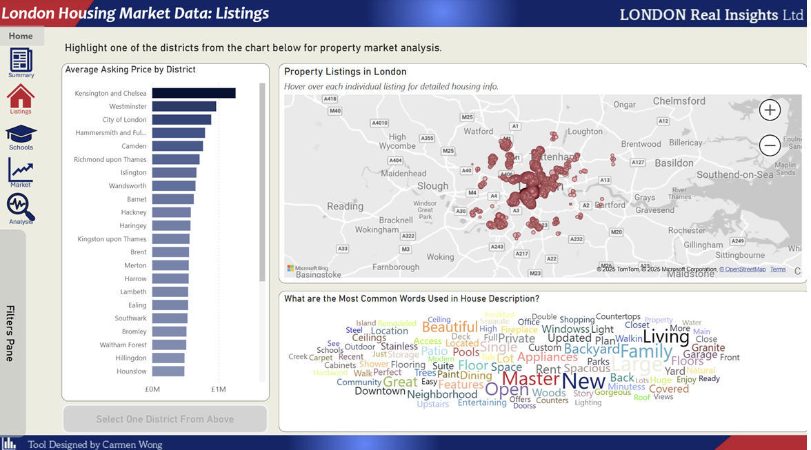
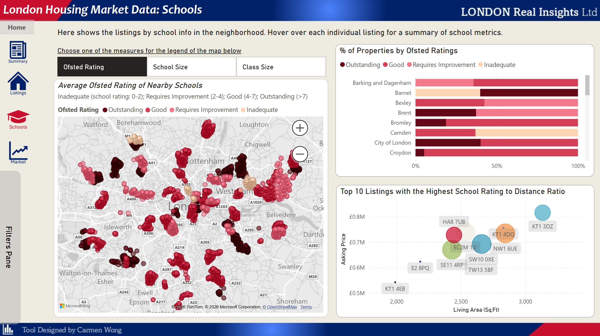
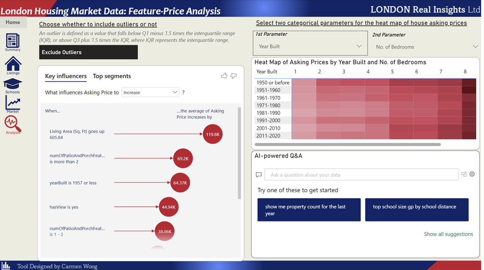

# London Housing Market Data Report

A Power BI dashboard for exploring and analyzing the London housing market, focusing on property prices, influential features, school information, and regional trends.

---

> **Disclaimer:**  
> *This dashboard uses synthetic data. All statistics, trends, and insights are for demonstration and educational purposes only and do not reflect actual London housing market conditions.*

---

## Overview

This Power BI report provides a comprehensive analysis of the London housing market, enabling users to:
- Explore asking and sold prices by district, year, and property features.
- Identify key drivers of property prices.
- Analyze housing trends in relation to school quality and location.
- Drill down into individual districts and property listings.

---

## Features

- **Dashboard**: View total listings, median asking prices, average property sizes, and school ratings.
- **District Heatmaps**: Visualize asking and sold prices across London districts.
- **Feature-Price Analysis**: Show which property features most influence asking price using interactive key influencer visuals.
- **Pivoted Heat Maps**: Analyze asking prices by categorical features such as year built and number of bedrooms.
- **School Analytics**: Map property listings by proximity to schools, Ofsted ratings, school size, and class size.
- **Listings Explorer**: Browse listings by district, location, and feature word clouds.
- **Market Trends**: Track historical price trends, growth rates, and compare district prices to national medians.
- **AI-powered Q&A**: Ask natural language questions about the data.

---

## Screenshots

| Dashboard | Listings | Schools Analystics | Feature-Price Analysis |
|:--:|:--:|:--:|:--:|
|  |  |  |  |

---

## Steps

1. **Access Power BI report online** [here](https://app.powerbi.com/view?r=eyJrIjoiYzdkNTE2YTctMTAyMy00NWIzLWE5ZmEtZDIxYjJkNzNkMGVlIiwidCI6IjZjMWQ0MTUyLTM5ZDAtNDRjYS04OGQ5LWI4ZDZkZGNhMDcwOCIsImMiOjEwfQ%3D%3D)
2. **Navigate via the sidebar or the homepage** to explore:
   - **Summary**: Market snapshot and key figures.
   - **Listings**: Average prices, property locations, and feature word clouds.
   - **Schools**: Listings by school rating, size, and proximity.
   - **Market**: Trends of the property price by districts and comparison to the national median.
   - **Analysis**: Deep-dive into feature impacts and price segmentation.
3. **Interact with filters and slicers** to customize your analysis:
   - Filter by year, district, home type, or features.
   - Use the outlier exclusion toggle for robust statistics.
   - Ask AI-powered questions for instant insights.

---

## Data Sources

- Synthetic housing data generated for analysis and demonstration purposes
- Synthetic Ofsted school ratings and metrics
- Simulated national housing price statistics

> **Note:**  
> All datasets used in this project are synthetic, created to mimic real-world patterns for educational and analytical demonstration only. No real personal, commercial, or sensitive data is included.

---

## Key Insights

- **Living area**, **year built** and **number of patios/porches** are strong drivers of asking price.
- Older homes (built ≤1957) can command premiums in some segments.
- School quality and proximity are significant for certain districts, such as Harrow and Kingston upon Thames.
- Districts like Kensington and Chelsea, Westminster, and City of London have the highest average asking prices.
- Historical price trends reveal steady growth with cyclical fluctuations.

---

## Author

**Carmen Wong**  

---
